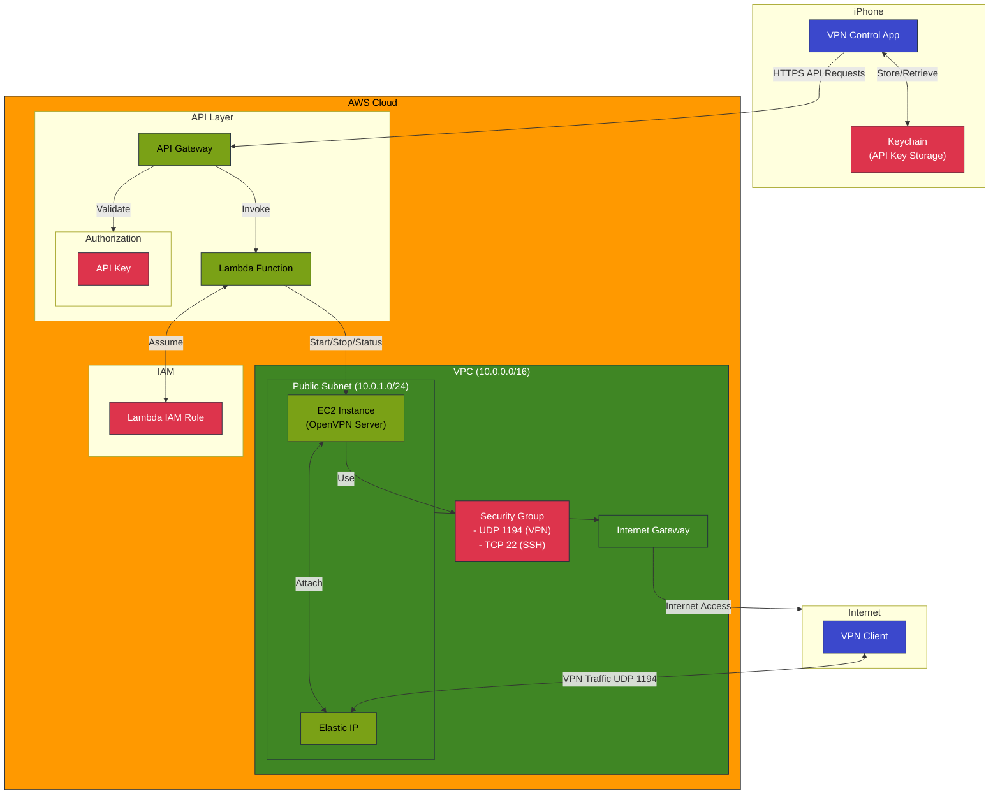

# Personal VPN Control System

A complete solution for deploying and managing a personal VPN service using AWS, created during a sabbatical in Taipei. The project demonstrates the potential of AI-assisted development, with nearly all code generated using ChatGPT and Claude. 

*Note: [Complete chat transcripts creating this project are included](GenAI_chats/README.md)*

## System Architecture


## Components

This project consists of three main components, each in its own repository:

### 1. [vpn-infra-tf](https://github.com/TerrorTunnels/vpn-infra-tf)
Infrastructure as Code for the VPN server:
- AWS VPC and networking
- EC2 instance with OpenVPN
- Security groups and access controls
- Terraform configuration

### 2. [vpn-control-api](https://github.com/TerrorTunnels/vpn-control-api)
Serverless control interface:
- AWS API Gateway
- Lambda function
- EC2 instance management
- Security and monitoring

### 3. [VPNControl-ios](https://github.com/TerrorTunnels/VPNControl-ios)
iOS mobile application:
- SwiftUI-based interface
- Real-time status monitoring
- Secure API key storage
- Start/Stop controls

## Quick Start

1. Deploy Infrastructure:
```bash
git clone git@github.com:TerrorTunnels/vpn-infra-tf.git
cd vpn-infra-tf
# Follow README instructions
```

2. Set up API:
```bash
git clone git@github.com:TerrorTunnels/vpn-control-api.git
cd vpn-control-api
# Follow README instructions
```

3. Configure iOS App:
```bash
git clone git@github.com:TerrorTunnels/VPNControl-ios.git
cd vpncontrol-ios
# Follow README instructions
```

## Development

Each repository contains detailed setup instructions and documentation. The typical workflow is:

1. Deploy infrastructure using Terraform
2. Configure API Gateway and Lambda function
3. Build and deploy iOS app
4. Configure app with API endpoint and key

## Contributing

Contributions are welcome to any of the repositories! Please read the individual contribution guidelines in each repository.

## Project Status

- ✅ Infrastructure: Production-ready
- ✅ API: Production-ready
- ✅ iOS App: Production-ready

## License

All repositories are licensed under the MIT License.

## Acknowledgments

- AWS for the cloud infrastructure
- OpenVPN for the VPN software
- ChatGPT and Claude for code generation
	- Full chats transcripts 
		- VPN infra [GenAI_chats/vpn-infra](../GenAI_chats/vpn-infra/AWS_VPN_ChatGPT.md)
		- REST API [GenAI_chats/api-setup](../GenAI_chats/api-setup/Serverless_API.md)
		- iOS app [GenAI_chats/ios-app](../GenAI_chats/ios-app/iOS_app.md)
- The Swift and iOS developer community

## Contact

For questions or suggestions, please open an issue in the relevant repository.
